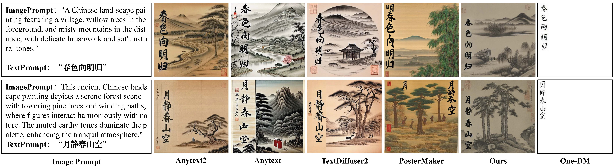
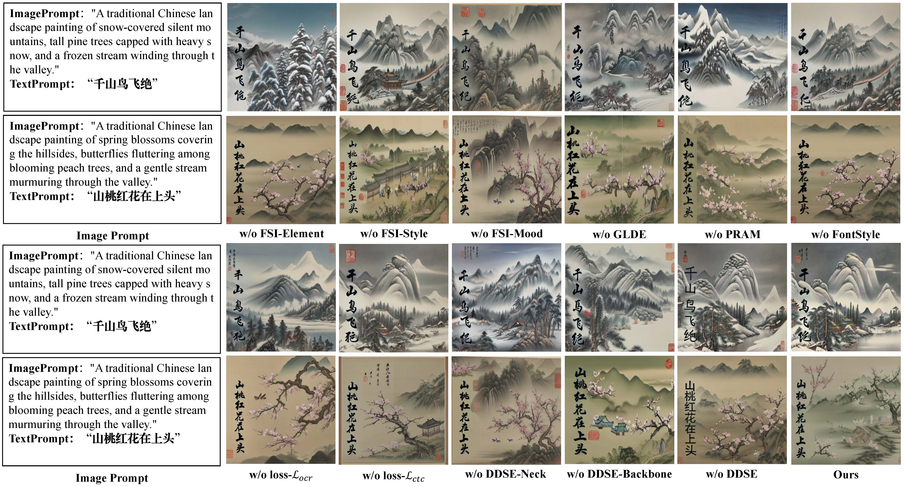
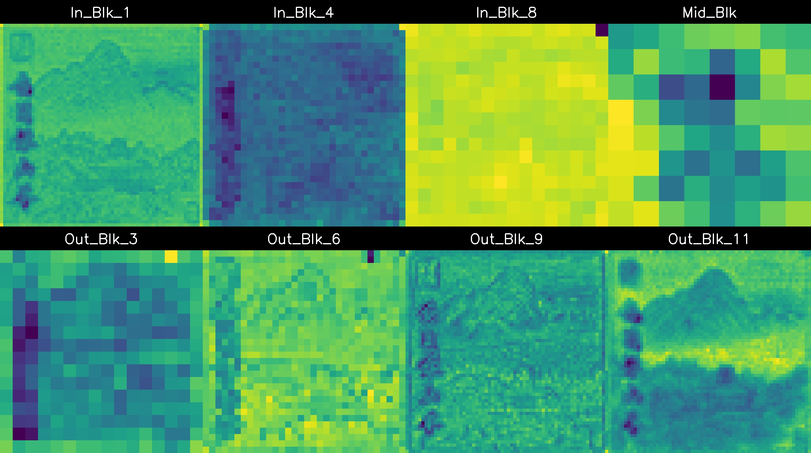

# CalliPaint: Fine-Grained Calligraphy-Landscape Synthesis via Decoupled Font Encoding and Parallel Residual Attention
[](https://opensource.org/licenses/MIT) []() [](https://pytorch.org/)
## 📖 Introduction

CalliPaint is a diffusion-model-based generation framework designed to address several challenges in traditional ink-wash painting generation, including unnatural integration between calligraphic inscriptions and background scenes, insufficient brushstroke details such as dry-brush texture and ink diffusion, and unstable character structures. By introducing parallel residual attention and decoupled style encoding, the model enables precise control over both glyph morphology and ink-texture characteristics, allowing calligraphy to be organically integrated with the artistic mood and blank-space composition of ink-wash landscapes.

**Note:** Since the paper is currently under submission, this repository temporarily hides detailed technical information and only presents qualitative visual results. More details will be updated after the paper is officially accepted.

## 📢 Open Source Plan

**Core inference code:** ✅ Released on April 27, 2026. This repository provides complete single-GPU inference scripts and batch generation scripts.

**Calliscape dataset:** ✅ Officially released on April 27, 2026. The dataset contains 20,000 background images without calligraphy and 8,000 samples with annotated calligraphic inscriptions.

**Paper / Preprint:** ⏳ Under review.

**Model weights and training code:** ⏳ Will be released immediately after the paper is officially accepted.

## 🏗️ Core Methodology


*Figure 1. Overall architecture of CalliPaint. The detailed model design will be disclosed after the paper is officially accepted.*

## 🐧 Linux Deployment

We recommend running the project on Ubuntu 20.04/22.04 LTS with a CUDA-enabled GPU.

### 1. Basic Environment Setup

Use `conda` to quickly create the development environment:

```bash
# Clone the repository
git clone https://github.com/NickCheung02/CalliPaint.git
cd CalliPaint

# Create the environment according to environment.yaml
conda env create -f environment.yaml
conda activate callipaint
```

### 2. Parameter Configuration Guide

During inference, you can control the generation results by modifying the following key hyperparameters in the core scripts:

| Parameter        | Recommended Value | Physical Meaning and Tuning Suggestions                      |
| ---------------- | ----------------: | ------------------------------------------------------------ |
| Beta ($\beta$)   |               0.3 | OCR style-aware weight. It controls the strength of calligraphic style, such as dry-brush texture, flying white strokes, and ink wetness variations. Increasing this value can enhance the artistic effect, but an excessively high value may introduce rough or noisy stroke edges. |
| Gamma ($\gamma$) |               0.5 | Recognition/readability weight. Based on CTC loss, it helps ensure character-structure stability and readability. Increasing this value can reduce incorrect characters, but an excessively high value may make the text appear rigid or printed, as if pasted onto the image. |
| CFG Scale        |           7.5–9.0 | Prompt guidance strength. It determines how closely the generated image follows the prompt description. A value around 9.0 is recommended to balance background artistic mood and calligraphy presentation. |

## 🚀 Inference

The core inference code is ready. After the model weight files are released, please place them in the `models/` directory. You can then run the following scripts for testing.

### Method A: Single-GPU Inference with a Python Script

This method is suitable for debugging specific prompts and calligraphic text.

```bash
python eval/infer_CalliPaint.py \
    --ckpt_path "$CKPT_PATH" \
    --input_json "$INPUT_JSON" \
    --output_dir "$OUTPUT_DIR"
```

### Method B: Batch Generation with a Shell Script

This method is suitable for large-scale generation on the test set for qualitative evaluation.

```bash
# Before running, please modify the environment variables and dataset paths
# in the script according to your actual settings.
# vim eval/infer_Callipaint_bash.sh

# Grant execution permission and run the script
chmod +x eval/infer_Callipaint_bash.sh
bash eval/infer_Callipaint_bash.sh
```

## 🚀 Training Tutorial

CalliPaint adopts a two-stage progressive training strategy to jointly achieve calligraphic brushstroke rendering and glyph-structure control.

### 1. Data Preparation

Make sure that you have downloaded the Calliscape dataset. The dataset contains:

20k background images without calligraphy, used for learning the visual prior of landscape painting.

8k samples with calligraphy annotations, used for learning brushstroke rendering and text alignment.

### 2. Training Steps

The model is trained on an ($8 \times$) NVIDIA H20 cluster using the AdamW optimizer with a learning rate of ($2 \times 10^{-5}$).

### Stage 1: Learning the Scene Generation Prior

In this stage, the network mainly adapts to the multi-channel semantic routing mechanism.

```bash
# Modify TRAINING_STAGE in train.py ---> 1
# Modify json_paths in train.py ---> the actual JSON path
python train.py
```

### Stage 2: Learning Calligraphy Control

In this stage, the U-Net backbone is frozen, while the PRAM, DDSE, and GLDE modules are optimized.

```bash
# Modify TRAINING_STAGE in train.py ---> 2
# Modify json_paths in train.py ---> the actual JSON2 path
python train.py
```

## 🖼️ Visual Results

The following section presents qualitative results of the model on the Calliscape and AnyWord-3M datasets.



***Figure 2**. Visual comparison with mainstream SOTA methods. CalliPaint achieves more natural integration between calligraphic inscriptions and ink-wash landscape backgrounds.*



***Figure 3**. Ablation study results. The figure demonstrates the contribution of PRAM, FSI, and DDSE to the final generation quality.*



***Figure 4**. Feature evolution analysis. The figure visualizes the transformation of features from the input layer to the output layer of the U-Net.*

## 📝 Citation

After the paper is officially published, please cite it in the following format:

```bibtex
@article{
}
```

## 📧 Contact

For inquiries about the dataset, code, or research collaboration, please contact the corresponding author:

Qiyao Hu: [huqiyao@nwu.edu.cn](mailto:huqiyao@nwu.edu.cn).
